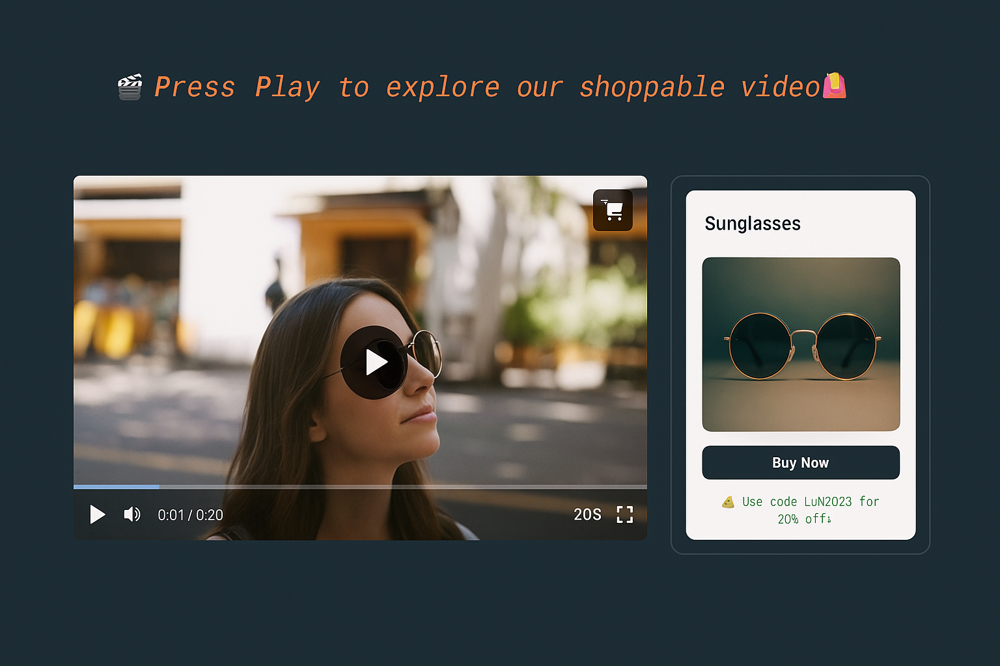

# 🛍️ How to Add Shoppable Videos to Your Next.js E-commerce Store with Cloudinary 📹



> A modern demo storefront showcasing how to make your videos shoppable—turn viewers into buyers! 🚀

---

## ✨ Features

- 📺 **Interactive Video**: Embed shoppable videos with clickable hotspots
- 🛒 **Slide-In Product Bar**: Animated drawer for product details & quick-add to cart
- 📊 **Analytics Ready**: Capture plays, pauses, clicks for deeper insights
- 📱 **Responsive Design**: Mobile-friendly bottom sheet ensures seamless UX
- 🔒 **Secure Server Actions**: Generate Cloudinary signatures server-side
- ⚡ **Edge API Routes**: Lightning-fast product metadata & analytics beacons

---

## 🛠️ Built With

[](https://nextjs.org/)  
[](https://cloudinary.com/)  
[](https://tailwindcss.com/)  
[](https://ui.shadcn.com/)  
[](https://motion.dev/)

---

## 📚 Table of Contents

1. [Prerequisites](#prerequisites)
2. [Local Setup](#local-setup)
3. [.env Configuration](#env-configuration)
4. [Available Scripts](#available-scripts)
5. [Deploying](#deploying)
6. [Useful Links](#useful-links)

---

## ✅ Prerequisites

- **Node.js 18+** (tested on Node 20)  
  ```bash
  nvm install 20 && nvm use 20
  ```
- A free [Cloudinary](https://cloudinary.com/) account 🔑  
  • Cloud Name  
  • API Key & Secret

---

## 🚀 Local Setup

```bash
# 1. Clone the repo
git clone https://github.com/musebe/Shoppable-Video-Demo-Next.js-Cloudinary.git
cd Shoppable-Video-Demo-Next.js-Cloudinary

# 2. Install dependencies
npm install

# 3. Copy & configure env\cp .env.example .env.local
# → Fill in your Cloudinary credentials

# 4. Run dev server
npm run dev
# → Open http://localhost:3000
```

---

## ⚙️ .env Configuration

Create a `.env.local` file with:

| Key                                 | Example             | Description                             |
|-------------------------------------|---------------------|-----------------------------------------|
| `NEXT_PUBLIC_CLOUDINARY_CLOUD_NAME` | `my-cloud`          | Public Cloudinary cloud name            |
| `NEXT_PUBLIC_CLOUDINARY_FOLDER`     | `shoppable-demo`    | Folder for demo assets                  |
| `CLOUDINARY_API_KEY`                | `123456789012345`   | API Key (server-side only)              |
| `CLOUDINARY_API_SECRET`             | `s0m3-sup3r-s3cr3t` | API Secret (server-side only)           |

> ✋ **Never** commit `.env.local` or real secrets.

---

## 📜 Available Scripts

| Command         | Description                            |
|-----------------|----------------------------------------|
| `npm run dev`   | Start development server               |
| `npm run build` | Build for production                   |
| `npm run start` | Launch production server               |
| `npm run lint`  | Lint & type-check code                 |

---

## 🌐 Deploying

Deploy effortlessly on **Vercel**:

1. Push to GitHub
2. Import in Vercel (https://vercel.com/)
3. Add the same env vars
4. Click **Deploy** 🔥

Also works on Netlify, Render, Cloudflare Pages—just set env vars!

---

## 🔗 Useful Links

- 📘 [Shoppable Video Docs](https://cloudinary.com/documentation/video_player_shoppable_videos)
- 📘 [Video Player Basic Usage](https://next.cloudinary.dev/cldvideoplayer/basic-usage)
- 💫 [Motion.dev Quickstart](https://motion.dev/docs/react-quick-start)
- 🛠 [shadcn/ui](https://ui.shadcn.com/)
- 🧠 [Next.js Image Optimization](https://nextjs.org/docs/app/building-your-application/optimizing/images)

---

_Ready to transform your videos into a shopping experience? Let’s code!_ 🎉

